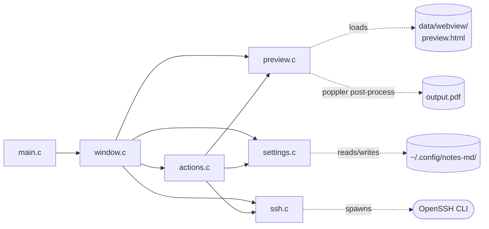
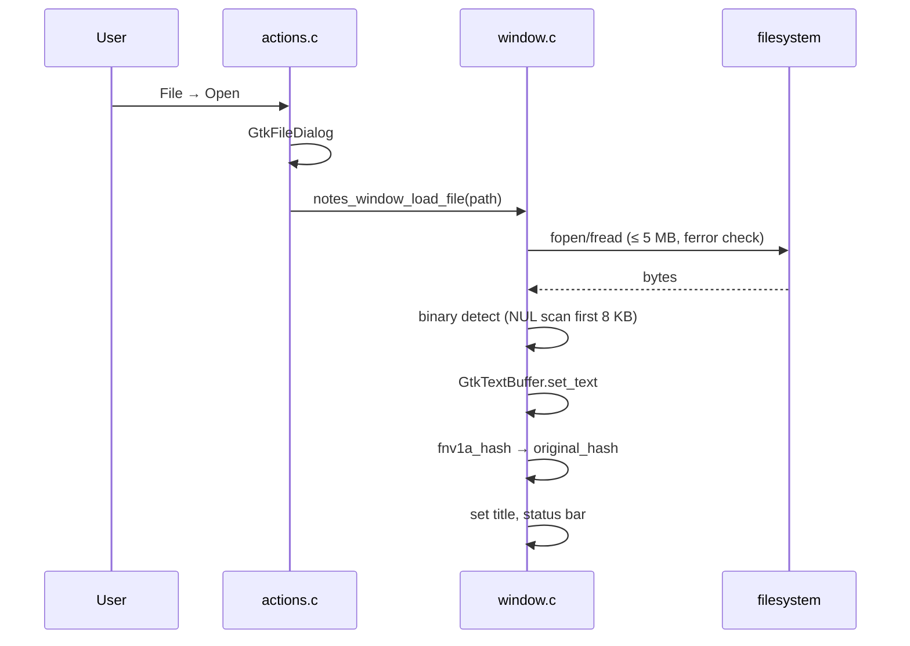
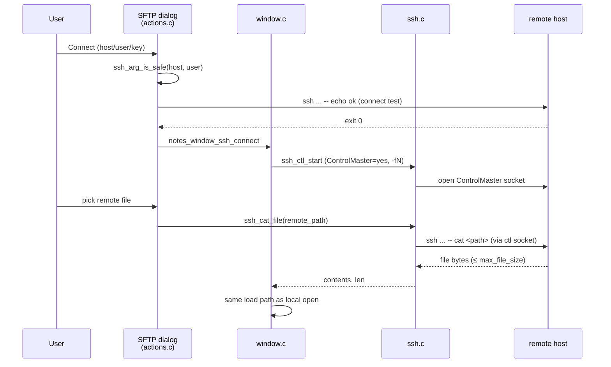
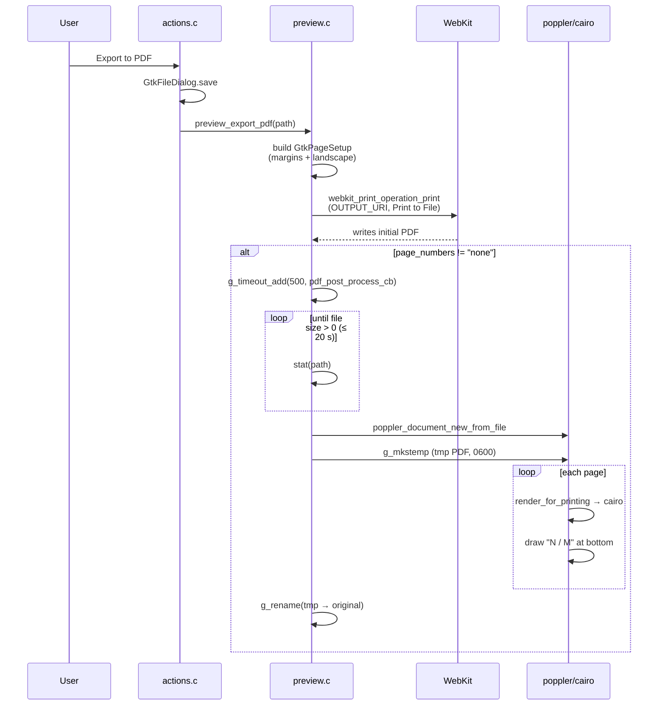
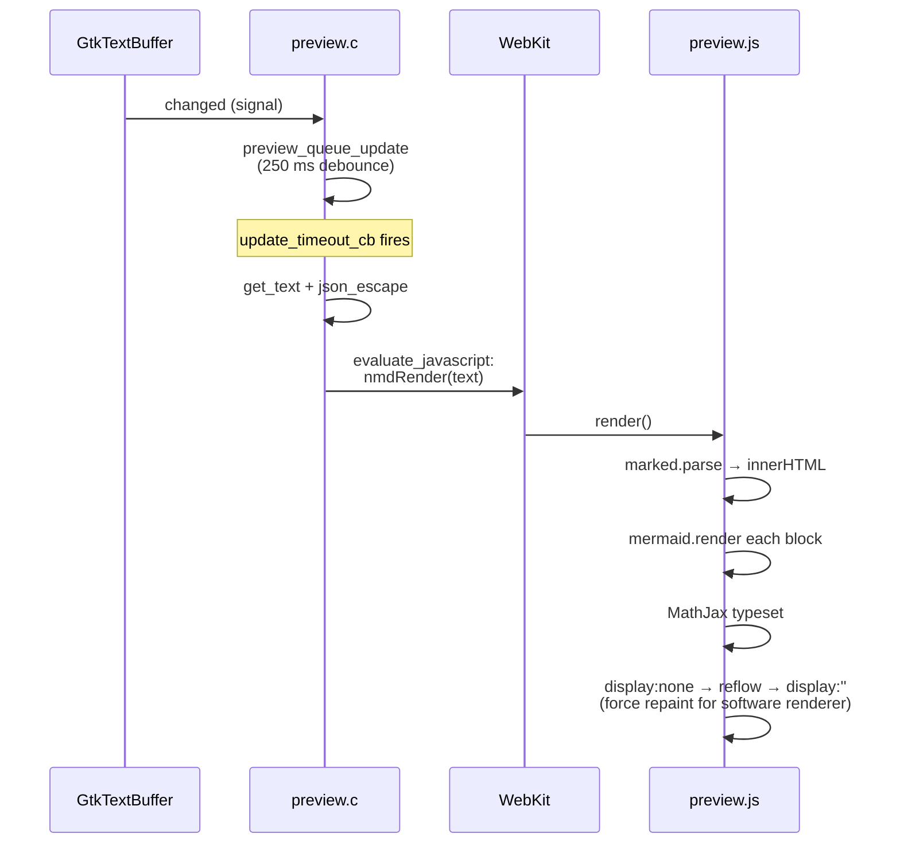
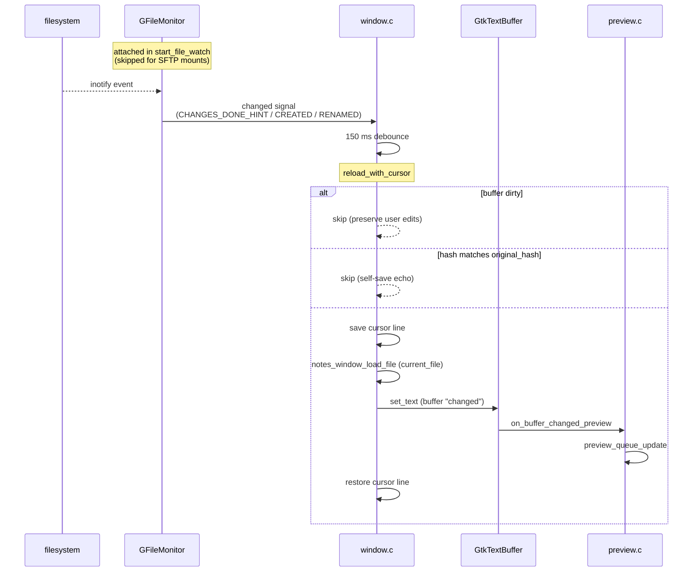
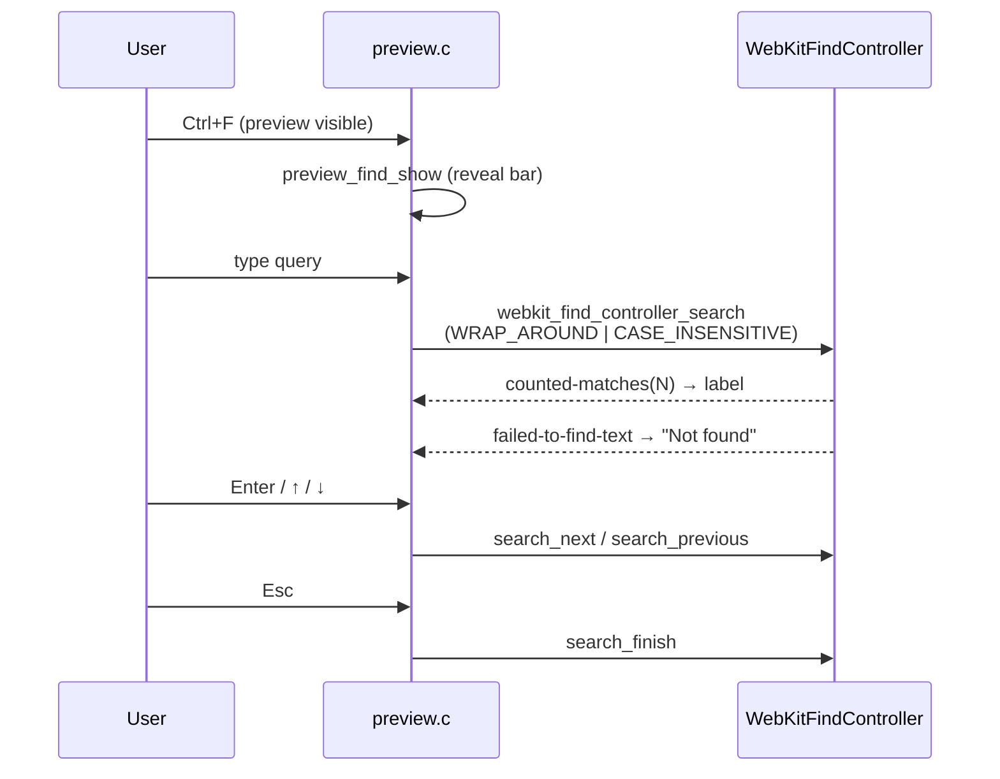
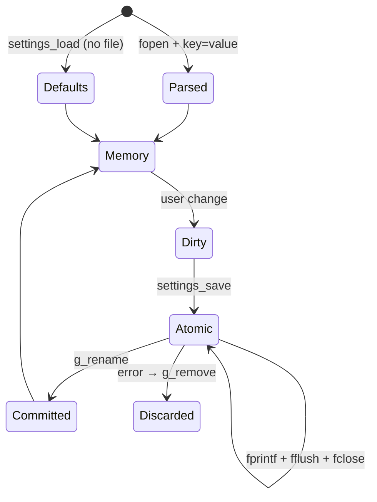

# Diagrams

Mermaid diagrams of the notes-md architecture and key runtime flows.

## Module dependency graph

## Local file open

## Remote (SSH) file open

## PDF export with page numbers

## Preview update pipeline

## External file reload (watch_file)

## Find-in-preview

## Settings persistence

